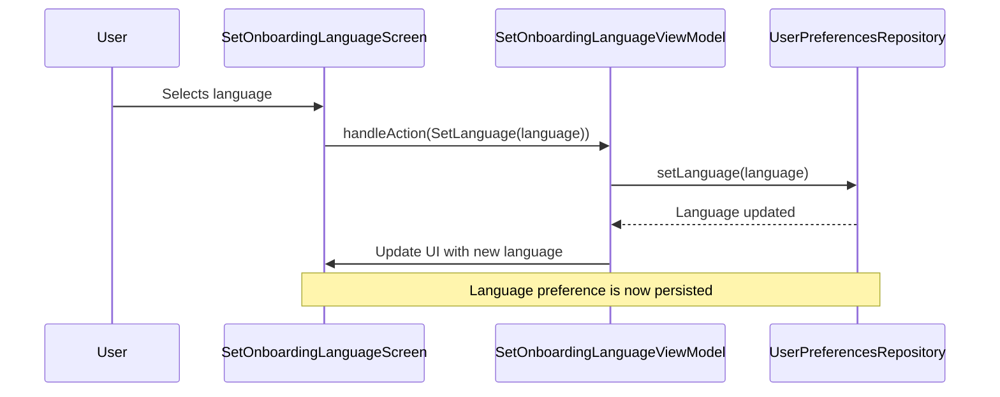
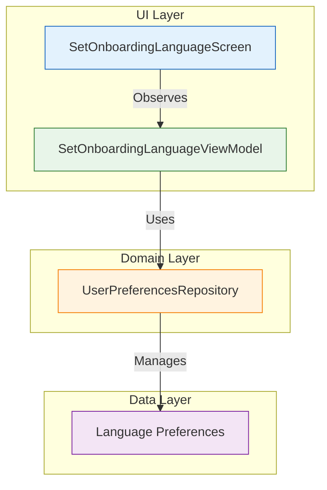

# Onboarding Language Module

## Dependencies

## Sequence Diagram

```mermaid
sequenceDiagram
    participant User
    participant Screen as SetOnboardingLanguageScreen
    participant ViewModel as SetOnboardingLanguageViewModel
    participant Repository as UserPreferencesRepository
    
    User->>Screen: Selects language
    Screen->>ViewModel: handleAction(SetLanguage(language))
    ViewModel->>Repository: setLanguage(language)
    Repository-->>ViewModel: Language updated
    ViewModel->>Screen: Update UI with new language
    
    Note over Screen,Repository: Language preference is now persisted
```

## Architecture

```mermaid
graph TD
    subgraph UI Layer
        A[SetOnboardingLanguageScreen] -->|Observes| B[SetOnboardingLanguageViewModel]
    end
    
    subgraph Domain Layer
        B -->|Uses| C[UserPreferencesRepository]
    end
    
    subgraph Data Layer
        C -->|Manages| D[Language Preferences]
    end
    
    style A fill:#e3f2fd,stroke:#1565c0
    style B fill:#e8f5e9,stroke:#2e7d32
    style C fill:#fff3e0,stroke:#f57c00
    style D fill:#f3e5f5,stroke:#7b1fa2
```
